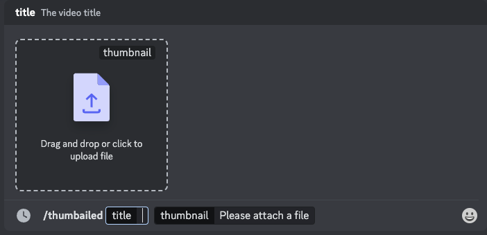
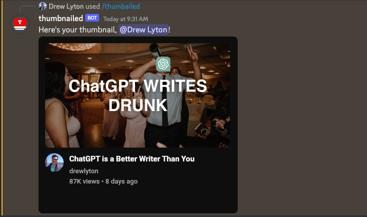

# Thumbnailed

This is a Discord bot originally created for the [Colin & Samir](https://discord.com/invite/colinandsamir) server that generates a representation of what a video would look like on YouTube given a title and a thumbnail.

It is written using [`discord.js`](https://discordjs.guide) and Typescript. It is hosted on [`fly.io`](https://fly.io).

If you'd like to see it in action, you can join the [development server](https://discord.gg/uTbz3UgmCR).

If you'd like to add the bot to your server, [click here](https://discord.com/api/oauth2/authorize?client_id=1118996288579571843&permissions=277025442880&scope=bot%20applications.commands).

If you have any questions or need to contact me, send me a message at [thumbnailed@drewis.cool](mailto:thumbnailed@drewis.cool)
